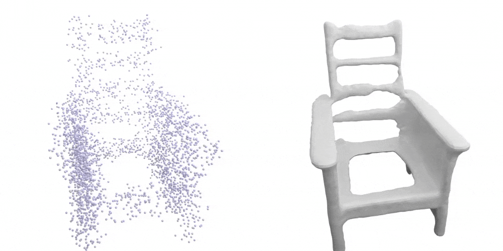
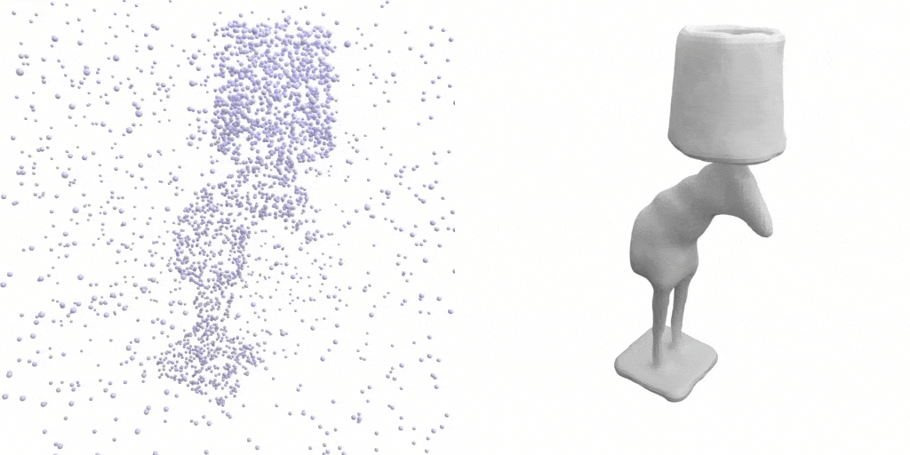
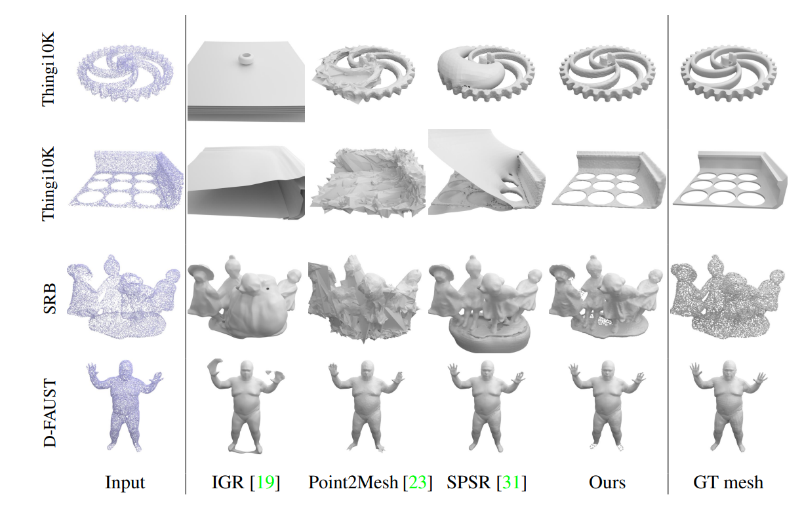

# Advances in Neural Information Processing Systems


### Learning-based 3D Surface Reconstruction





Neural implicit representations have shown promising results for representing geometry due to their flexibility in encoding varied topologies, and easy integration with differentiable frameworks. Point clouds do not directly encode surface information while meshes are usually restricted to fixed topologies. Neural information processing




# Dataset

### Dataset for Optimization-based Reconstruction
The following datasets were considered: 
- [Thingi10K](https://arxiv.org/abs/1605.04797) (synthetic)
- [Surface Reconstruction Benchmark (SRB)](https://github.com/fwilliams/deep-geometric-prior) (real scans)
- [MPI Dynamic FAUST](https://dfaust.is.tue.mpg.de/) (real scans)


### Dataset for Learning-based Reconstruction  
Data is trained and evaluated on [ShapeNet](https://shapenet.org/).
It is possible to be downloaded the processed dataset (~220 GB) by running:
```bash
bash scripts/download_shapenet.sh
``` 
The dataset should be found in `data/shapenet_psr` folder.


### Training

To train a new network from scratch, simply run:
```python
python train.py configs/learning_based/CONFIG.yaml
```
For available training options, take a look at `configs/default.yaml`.


<body>
  <h1>Point Cloud to Mesh Converter</h1>
  <form id="uploadForm">
    <input type="file" accept=".xyz, .ply" id="pointCloudFile" required>
    <button type="submit">Convert to Mesh</button>
  </form>
  <div id="result"></div>

  <script src="main.js"></script>
</body>

  <body>
    <h1>Point Cloud to Mesh Converter</h1>
    
    <div id="dropZone" ondrop="handleDrop(event)" ondragover="handleDragOver(event)">
        <p>Drag and drop point cloud file here, or click to select file.</p>
        <input type="file" id="pointCloudInput" accept=".xyz, .ply" style="display: none;" onchange="handleFileSelect(event)">
    </div>
    
    <div id="meshViewer"></div>

    <script src="main.js"></script>
</body>
